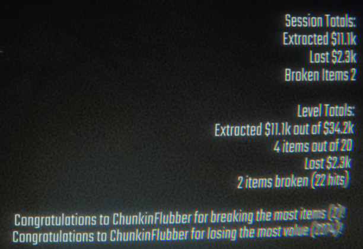

# R.E.P.O. mods!

I also have never done modding before, but R.E.P.O. is fun, and I like stats so why not edit a mod that wasn't working? :>

## Post Level Summary
# Credit to Hattorius for the original idea and base mod source!
I just simplified the code, fixed a few issues, and added a congratulations for the player who broke the most and lost the most value.
A non-invasive mod. No extra advantages, just cool stats! After finishing a level, it gives you:
- 💰 The amount of $ value you extracted vs. the total available.
- 📦 The number of items you extracted vs. the total available.
- 🔨 Total $ value lost due to items smashing & breaking.
- 💔 How many items got wrecked.
- 👊 How many hits items took (that made them lose value).

# Got any problems?
Drop an issue with screenshots & all the details you’ve got. I'll see what I can do! 😎
